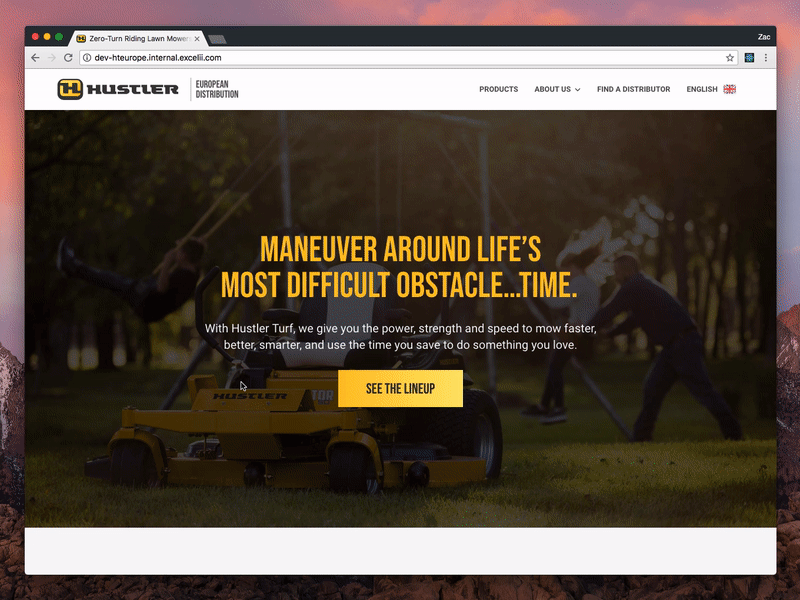

## Preview
  

---

## Want to run this project?
In the project directory, you can run:

### `npm install`

Installs all of the necessary dependencies. 
Then run:

### `npm start`

Runs the app in the development mode. 
Open [http://localhost:3000](http://localhost:3000) to view it in the browser.

